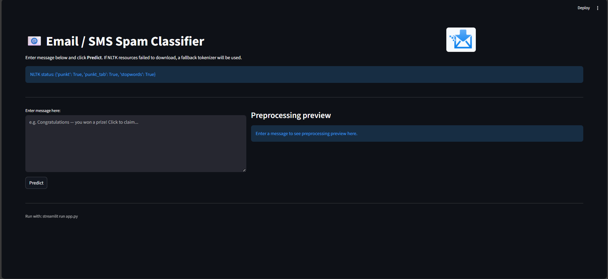

# 📧 Email / SMS Spam Classifier

## Title

**Email / SMS Spam Classifier** — A lightweight Streamlit app and notebook that trains a text classifier (Multinomial Naive Bayes by default) to detect spam messages using TF-IDF features.

---

## Description

This project contains a reproducible Jupyter notebook (`Spam_Classifier.ipynb`) for exploring and training a spam detection model and a Streamlit app (`app.py`) to demo the trained model in a web UI. The pipeline includes text cleaning (tokenization, stopword removal, stemming), TF-IDF vectorization, model training, serialization (`vectorizer.pkl`, `model.pkl`), and a user interface to predict whether an input message is spam.

The Streamlit app is resilient to missing NLTK resources: it attempts to download `punkt`, `punkt_tab`, and `stopwords` on startup and falls back to a simpler tokenizer if downloads fail (useful when running offline).

---

## Features

* Train a spam/ham classifier from scratch using the provided notebook.
* TF-IDF feature extraction with configurable `max_features` (notebooks set `3000`).
* Multiple model experiments provided (Logistic Regression, SVM, RandomForest, XGBoost, Naive Bayes, etc.).
* Production/demo-ready Streamlit app for quick predictions.
* Safe tokenizer with graceful fallback when NLTK data is unavailable.
* Exports trained `vectorizer.pkl` and `model.pkl` for easy deployment.

---

## 📊 Model Comparison

| #  | Algorithm              | Accuracy | Precision | Accuracy (TF-IDF 3000) | Precision (TF-IDF 3000) |
| -- | ---------------------- | -------- | --------- | ---------------------- | ----------------------- |
| 0  | Random Forest          | 0.875242 | 1.000000  | 0.875242               | 1.000000                |
| 1  | MultinomialNB          | 0.970986 | 1.000000  | 0.970986               | 1.000000                |
| 2  | BernoulliNB            | 0.983559 | 0.991870  | 0.983559               | 0.991870                |
| 3  | Support Vector Machine | 0.975822 | 0.974790  | 0.975822               | 0.974790                |
| 4  | Extra Trees            | 0.974855 | 0.974576  | 0.974855               | 0.974576                |
| 5  | Logistic Regression    | 0.958414 | 0.970297  | 0.958414               | 0.970297                |
| 6  | XGBoost                | 0.967118 | 0.948276  | 0.967118               | 0.948276                |
| 7  | Gradient Boosting      | 0.957447 | 0.935185  | 0.957447               | 0.935185                |
| 8  | AdaBoost               | 0.960348 | 0.929204  | 0.960348               | 0.929204                |
| 9  | Bagging                | 0.957447 | 0.856061  | 0.957447               | 0.856061                |
| 10 | Decision Tree          | 0.930368 | 0.817308  | 0.930368               | 0.817308                |

---

## Requirements

* Python 3.8+ (recommended)
* Key Python packages used:

  * streamlit
  * scikit-learn
  * nltk
  * pandas
  * numpy
  * pillow
  * matplotlib, seaborn (for analysis/visuals in notebook)
  * wordcloud
  * xgboost (optional, for XGBoost experiments)

Install with pip (recommended to use a virtual environment):

```bash
python -m venv venv
source venv/bin/activate    # Linux / macOS
venv\Scripts\activate     # Windows PowerShell
pip install -r requirements.txt
```

If you don't have a `requirements.txt`, run:

```bash
pip install streamlit scikit-learn nltk pandas numpy pillow matplotlib seaborn wordcloud xgboost
```

---

## How to use (Run the app)

1. Make sure the following files exist at the project root:

   * `vectorizer.pkl` (TF-IDF vectorizer)
   * `model.pkl` (trained classifier)
   * `logo.png` (optional)

2. Start the Streamlit app:

```bash
streamlit run app.py
```

3. The app opens in your browser and shows prediction results.

---

## How to train (Notebook)

Follow steps in `Spam_Classifier.ipynb` to train and export the model.

---

## Screenshot / Demo
### 📷 Screenshot


## 🎥 Demo Video
[Click here to watch the video](assets/Spam-Classifier-Demo.mp4)

---

## Tech stack

* Python 3
* Streamlit
* scikit-learn
* NLTK
* pandas / numpy
* matplotlib / seaborn / wordcloud
* pickle

---

## Contributing

1. Fork the repo.
2. Create a feature branch.
3. Submit a PR.

---

## Security & Privacy

Avoid entering sensitive information when using the app.

---

## Author

**Abdul Rehman**
Data enthusiast.

---

## Quick links & commands

* Train model using notebook.
* Export vectorizer and model.
* Run app:

```bash
streamlit run app.py
```